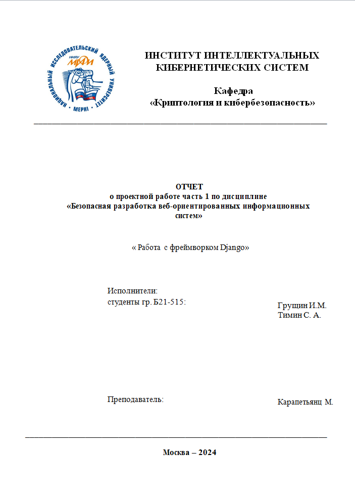
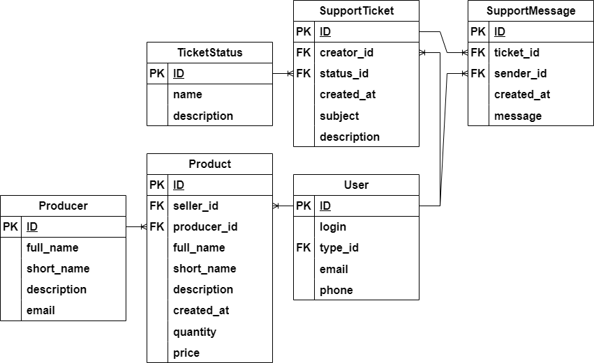
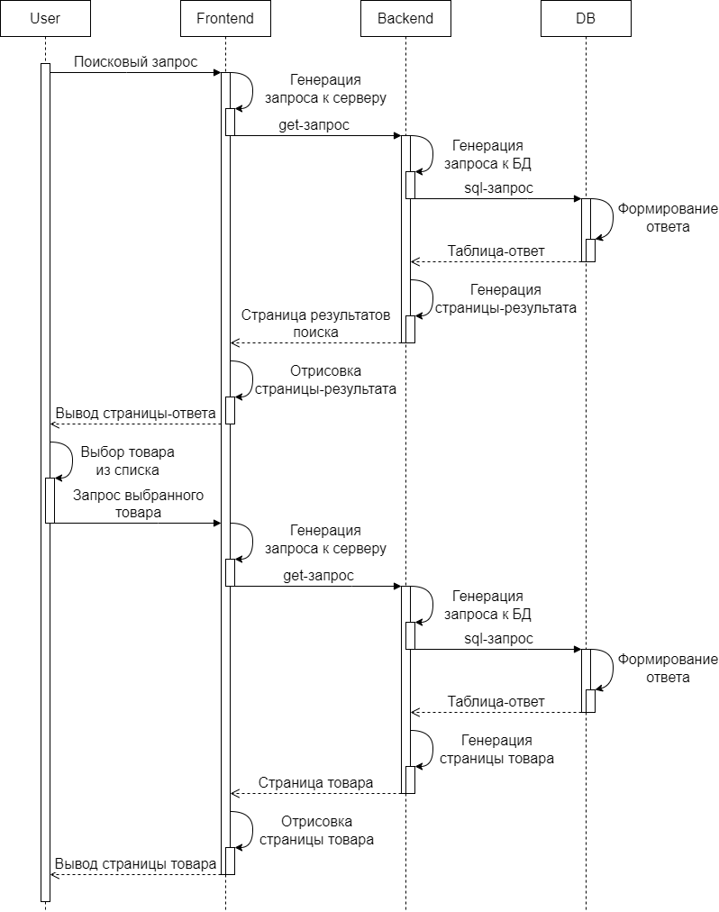
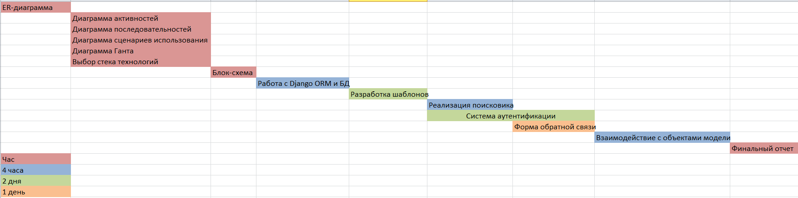

# Учебный проект CRM система на Django

## Титульный лист


## Представление предметной области
todo

## Описание проекта
Проект - сайт каталог товаров, можно сортировать по производителю, продавцу, цене, количеству.
Пользователи могут создавать свои карточки товаров и редактировать их, также есть возможность
создания чата с тех поддержкой, доступ к кторому имеют только создатель и суперпользователи.
При отправке сообщения в чате идет отправка письма на электронную почту через отдельный сервис.

## Планирование проекта
### ER-диаграмма


### Диаграмма классов


### Диаграмма последовательностей


### Диаграмма ганта


## How To Use It
- Install vagrant.
- Clone this repository manually
```
git clone https://gitlab.digital.mephi.ru/Katehok/goods_catalog
```
- Enter into to the "virtual" directory
- Start virtual machine
```
vagrant up
```
- Open localhost:8080
- Allow your browser open this page

## Использование уведомлений по почте
- Для нужен пароль приложения от гугла и имя пользователя, которые надо вписывать в virtual/.env
